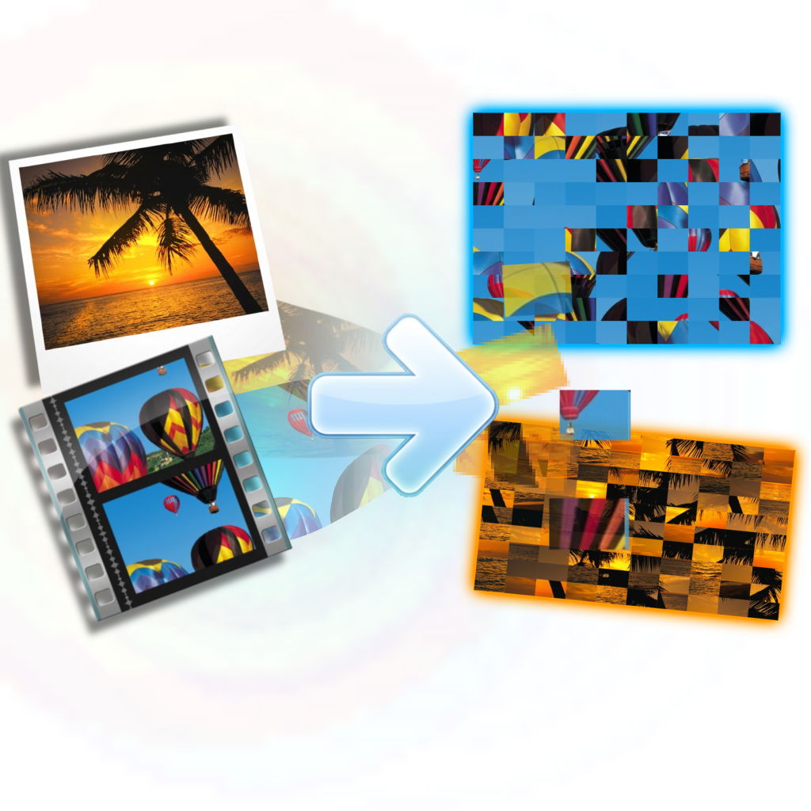

<div align="center">
  
</div>

# Media-Crypto

Welcome to **Media-Crypto**! This tool uses visual matrix scrambling and audio ring-modulation to completely encrypt your videos, images, and audio files locally.

### 🛠️ Manual Installation Guide

1. **Install Python**: Download Python 3.11+ from[python.org](https://www.python.org/downloads/). 
   *🚨 IMPORTANT: During the installer setup, you MUST check the box that says "Add Python.exe to PATH" at the bottom!*
2. **Open Terminal**: Open Command Prompt (`cmd`) or PowerShell inside this project's folder.
3. **Install Libraries**: Run the following command to download all required math and media libraries:
   ```bash
   pip install -r requirements.txt
   ```
   *(If that fails, run: `pip install Flask opencv-python numpy scipy soundfile imageio-ffmpeg`)*
4. **Run the Server**: Start the application by typing:
   ```bash
   python main.py
   ```
5. A browser window will automatically open, pointing to your local encryption studio. Enjoy!
